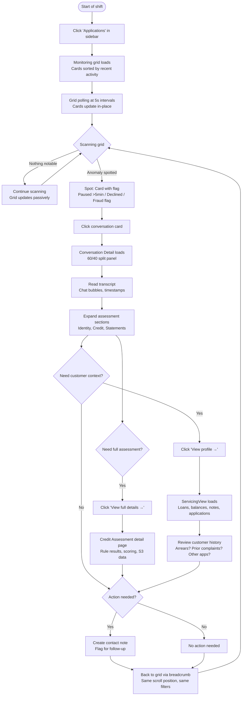
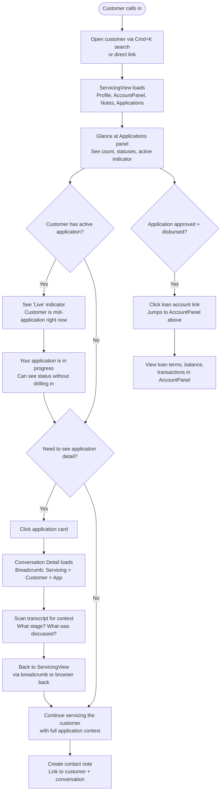

---
stepsCompleted:
  - 1
  - 2
  - 3
  - 4
  - 5
  - 6
  - 7
  - 8
  - 9
  - 10
  - 11
  - 12
  - 13
  - 14
status: complete
completedAt: '2026-04-03'
lastStep: 14
inputDocuments:
  - _bmad-output/planning-artifacts/product-brief-billie-crm-2026-02-20.md
  - _bmad-output/planning-artifacts/prd.md
  - docs/ux-design-specification.md
  - docs/ux-design/unified-account-panel.md
  - docs/ux-design/ledger-integration-ux.md
  - docs/ux-design/contact-notes-ux.md
  - docs/architecture.md
  - docs/project_context.md
  - docs/component-inventory-billie-crm-web.md
  - docs/index.md
workflowType: 'ux-design'
project_name: 'billie-crm'
user_name: 'Rohan'
date: '2026-04-03'
---

# UX Design Specification billie-crm

**Author:** Rohan
**Date:** 2026-04-03

---

<!-- UX design content will be appended sequentially through collaborative workflow steps -->

## Executive Summary

### Project Vision

**billie-crm-applications** replatforms the standalone billie-realtime supervisor dashboard into billie-crm, consolidating loan origination conversation monitoring into the existing staff servicing application. The vision is a single CRM where staff can monitor live loan origination conversations, investigate fraud signals, and service customer accounts — all in one place, with full context linking between conversations, customers, and applications. After this replatform, billie-realtime is retired.

The feature adds four major UI surfaces: an All Conversations monitoring view (card grid with real-time polling), a Conversation Detail view (split-panel with chat transcript and assessment data), Credit Assessment detail pages (S3-backed account conduct and serviceability), and a ServicingView conversations panel (customer-linked conversation context). The technical approach uses React Query polling at 3-5 second intervals, reading from the existing MongoDB conversations collection — no new infrastructure.

### Target Users

- **Alex Nguyen (Supervisor, primary):** Monitors 12+ live conversations daily. Needs a real-time overview card grid with instant drill-down to assessments and customer context. Investigates fraud signals by cross-referencing conversation data with customer records. Uses rich search to filter by decision status, date range, and customer/application identifiers.
- **Sarah Chen (Operations, secondary):** Sees conversations alongside loan accounts and contact notes when servicing customers on calls. Needs customer-linked conversation context — status and last message preview — without leaving the ServicingView.
- **David Park (Admin, tertiary):** Verifies system functionality, confirms role-based access, and oversees the decommissioning of billie-realtime.

### Key Design Challenges

- **Real-time monitoring density:** The All Conversations card grid must show 7+ data points per card across 12+ simultaneous conversations. Information hierarchy must enable scan-and-spot in seconds.
- **Split-panel conversation detail:** A 60/40 chat-transcript/assessment layout with independent scrolling, HTML sanitisation, and 3-second polling — the most complex new view in the app, with no existing precedent.
- **New patterns within existing design system:** Card grids, chat bubbles, split panels, and live status indicators must feel native to the "Payload Extended Modern" design language without forcing existing drawer/tab patterns where they don't fit.
- **Seven-state status model:** Active, paused, soft end, hard end, approved, declined, ended — must be distinguishable at a glance via colour + icon + label, consistent with established badge patterns.
- **Bidirectional cross-navigation:** Conversation to customer record and back, with a new conversations panel in ServicingView alongside AccountPanel and ContactNotes.

### Design Opportunities

- **Single pane of glass:** The killer differentiator — supervisors click from a suspicious conversation directly into the customer's full history (loans, balances, contact notes, prior conversations). billie-realtime has none of this.
- **Progressive disclosure for assessments:** Collapsible assessment sections grouped by category (Application, Identity, Credit, Statements, Noticeboard) let supervisors scan for flags without drowning in data.
- **Search as investigation tool:** Composable filters (decision status + conversation status + date range + customer/application) create a purpose-built fraud investigation interface.

## Core User Experience

### Defining Experience

The core experience is **"Passive Monitoring with Active Investigation."** Unlike the existing ServicingView (search → verify → act), conversation monitoring is a fundamentally different interaction model: eyes on the grid, scanning for status changes and anomalies, then drilling in when something needs attention. The product is successful if Alex can monitor 12+ live conversations, spot a flagged one, and reach the full customer context in under 10 seconds.

This is a shift from the "High-Velocity Financial Servicing" pattern that defines the rest of billie-crm. Servicing is reactive (customer calls, agent responds). Monitoring is proactive (supervisor watches, supervisor decides). The UX must support both modes within a single application without one feeling bolted onto the other.

### Platform Strategy

- **Primary:** Desktop Web (13"+ screens, Mouse/Keyboard). The main workstation experience for supervisors and operations staff.
- **Secondary:** Mobile Web (responsive). Supervisors need to glance at conversation status and drill into flagged conversations from their phone — particularly useful for after-hours monitoring, on-the-go checks, or when away from their desk. The mobile experience prioritises the monitoring grid and conversation detail; assessment deep-dives and search composition can be desktop-only.
- **Input Strategy:** Keyboard-first on desktop (existing shortcuts apply), touch-friendly on mobile (44px+ touch targets, simplified card layouts).
- **No offline requirement:** Real-time monitoring is inherently online. Polling failure is handled gracefully (stale data indicator, not a blocking error).

### Effortless Interactions

- **Grid scanning:** Conversation state is communicated through visual hierarchy — status badges, time indicators, and card ordering do the work so supervisors absorb state at a glance rather than reading card details.
- **Drill-down navigation:** Card → conversation detail → customer record → applications, and back. Each transition preserves context. Back navigation returns to the same grid position and scroll state.
- **Cross-reference:** From conversation detail, one click reaches the customer's full history (loans, balances, contact notes, prior conversations). From ServicingView, conversations are visible alongside existing panels.
- **Search composition:** Filters (decision status, conversation status, date range, customer name, application number) combine naturally. Add a filter, results update immediately. Clear all resets to the full grid.

### Critical Success Moments

- **"The grid tells the story"** — Alex glances at the monitoring view and immediately knows which conversations need attention. Visual hierarchy does the scanning, not her.
- **"Full context in two clicks"** — From a suspicious conversation card to the customer's complete history and back without losing place.
- **"It just updates"** — The grid refreshes live. Status badges change, new conversations appear, stale ones age out. No manual refresh, no jarring layout shifts.
- **"Found the pattern"** — Alex composes search filters and surfaces related declined conversations, spotting a fraud pattern across applicants.

### Experience Principles

1. **Scan, don't search:** The monitoring view surfaces what matters through visual hierarchy. Supervisors spot anomalies, they don't hunt for them.
2. **Context follows you:** Navigating between conversation, customer, and application never loses your place or requires re-finding where you were.
3. **Real-time without anxiety:** Live updates feel natural and calm — in-place updates, no layout shifts, no frantic flashing.
4. **Existing patterns, new surfaces:** Every new component feels like it belongs in billie-crm. Card grids, chat bubbles, and split panels are new surfaces, but they use the same design tokens, spacing, and interaction language.

## Desired Emotional Response

### Primary Emotional Goals

- **Calm Vigilance:** The monitoring view should feel like a well-lit control room, not an alarm dashboard. Alex is in command — the system surfaces what matters, and she trusts it to do so. The emotional register is "watching over" rather than "watching out for."
- **Informed Confidence:** When drilling into a conversation, the supervisor has everything needed to make a judgement call. No chasing information across tabs or systems. The split-panel delivers the full picture in one view.
- **Complete Context:** For operations staff, conversations in ServicingView close a blind spot. Sarah sees where the customer is in their application process alongside loans, balances, and notes. The feeling is "I have the whole picture."

### Emotional Journey Mapping

- **Opening the monitoring view (start of shift):** Calm readiness. A clean, scannable grid. "I can see what's happening." No information overload.
- **Scanning the grid (passive monitoring):** Quiet confidence. Status badges and time indicators communicate state without demanding attention. Normal conversations fade into the background; flagged ones surface naturally.
- **Spotting something (trigger moment):** Focused alertness. A conversation with a fraud flag or long pause catches the eye. The transition from scanning to investigating should feel natural, not jarring.
- **Drilling in (active investigation):** Informed control. The split-panel loads fast, transcript and assessments are immediately readable. "I have what I need."
- **Cross-referencing customer context (the payoff):** Satisfaction. One click to the customer's full history. "This is why we built this." The moment that makes billie-realtime feel primitive.
- **Something goes wrong (polling failure / stale data):** Calm awareness, not panic. A stale data indicator communicates "data may be delayed" without blocking the entire view or creating alarm.

### Micro-Emotions

- **Confidence** over Confusion — Status badges and card layout must be immediately readable. No ambiguous states.
- **Trust** over Skepticism — Polling updates must feel reliable. Subtle freshness indicators ("updated 3s ago") build trust that the data is current.
- **Calm** over Anxiety — 12+ active conversations should feel manageable. Card ordering and visual hierarchy prevent the grid from feeling overwhelming.
- **Satisfaction** over Relief — Cross-referencing a conversation with customer context should feel like a capability gain, not a workaround for a missing feature.

### Design Implications

- **Calm Vigilance → Neutral colour palette for normal states.** Active conversations should not scream for attention. Reserve strong colours (red, amber) for genuine flags. Green/blue for positive terminal states (approved). Grey for ended/inactive.
- **Informed Confidence → Information-complete split-panel.** No secondary clicks required to understand a conversation. Transcript, assessments, and customer link all visible on first load.
- **Trust → Freshness indicators.** Subtle "last updated" timestamps or pulse indicators on the monitoring grid. Stale data gets a visible but non-alarming indicator.
- **Calm over Anxiety → Smart card ordering.** Most-recently-active first. Conversations needing attention (paused, flagged) visually distinct but not flashing or bouncing.
- **Alert fatigue prevention → Status badge hierarchy.** Not all statuses are equal. "Active" is neutral. "Paused > 5 min" is attention-worthy. "Declined" is review-worthy. The visual weight should match the urgency.

### Emotional Design Principles

1. **Control room, not war room:** The default emotional state is calm readiness. Urgency is exception-based, not ambient.
2. **Trust through transparency:** Show data freshness. Show polling state. Never hide the fact that data might be seconds old — own it, and users will trust it.
3. **Reward investigation:** The cross-reference from conversation to customer context should feel like a superpower. Make this transition fast, seamless, and visually satisfying.
4. **Graceful degradation of emotion:** When things go wrong (polling fails, data is stale), the emotional shift should be from "calm" to "aware" — never from "calm" to "alarmed."

## UX Pattern Analysis & Inspiration

### Inspiring Products Analysis

**Intercom (Inbox View)**
- *Why it works:* Masters the "many conversations, one screen" problem. Card-based inbox with status indicators, unread counts, and customer context visible without opening the conversation. The split between inbox list and conversation detail is the defining pattern of support tooling.
- *Lesson for billie-crm:* The card grid → detail drill-down is directly transferable. Intercom's approach of showing customer metadata (name, company, location) on the card itself — without requiring a click — validates our "scan, don't search" principle.

**Datadog / Grafana Dashboards**
- *Why it works:* The "control room" metaphor executed well. Colour-coded status tiles, time-range selectors, and drill-down from overview to detail. Updates happen in-place without layout shifts. Stale data gets a visible timestamp, not a spinner.
- *Lesson for billie-crm:* The refresh-without-jank pattern is critical for polling UI. Datadog's approach of updating values in-place (the number changes, the card doesn't move) directly informs how our card grid should handle 5-second polling cycles. Their freshness indicators ("last updated 3s ago") solve the trust problem.

**Linear (Issue Tracking)**
- *Why it works:* Already established as a reference in billie-crm's design system. Scannable density, keyboard-first navigation, command palette, and status badges that communicate at a glance.
- *Lesson for billie-crm:* The existing billie-crm patterns (Cmd+K, keyboard shortcuts, badge design) carry forward. Linear's list density and typography hierarchy inform how much data we can show per card without visual overload.

**Slack / iMessage (Chat UI)**
- *Why it works:* The universal chat pattern. Left-aligned (other party) and right-aligned (self/assistant) message bubbles with timestamps and attribution. Users understand this layout intuitively — zero learning curve.
- *Lesson for billie-crm:* The conversation detail transcript should use the standard chat bubble pattern: customer messages left-aligned, AI assistant messages right-aligned. Timestamps between message groups, not on every message. This is not a place for innovation — familiarity is the feature.

**billie-realtime (The product being replaced)**
- *What works:* Card-based conversation layout, status badges, basic message display. The core information architecture is sound.
- *What's missing:* No customer context (the biggest gap). No search or filtering. Separate auth system. Redis KV state layer adds operational complexity. No keyboard navigation. No mobile support.
- *Lesson for billie-crm:* Preserve the card layout DNA that supervisors are already familiar with, but enrich every surface with the customer context that billie-realtime never had.

### Transferable UX Patterns

**Navigation Patterns:**
- **Card grid → split-panel detail** (from Intercom): The monitoring grid is the entry point. Clicking a card opens the conversation detail. Back navigation returns to the grid at the same scroll position. This is the primary navigation loop.
- **Bidirectional context linking** (from Intercom): Conversation detail shows a customer link. Customer ServicingView shows conversation cards. Both directions are one click.

**Interaction Patterns:**
- **In-place polling updates** (from Datadog): Card content updates without reordering or layout shifts during a polling cycle. New conversations append to the top. Status badge changes animate subtly (colour transition, not a flash).
- **Composable filters** (from Linear): Filter bar with dropdowns that combine naturally. Each filter narrows the result set immediately. "Clear all" resets to the full grid. Filter state persists during the session.

**Visual Patterns:**
- **Status badge hierarchy** (from Linear + Datadog): Not all statuses are equal weight. Active = neutral dot. Paused = amber. Declined = red. Approved = green. The colour hierarchy maps to attention priority, not just state.
- **Chat bubbles with attribution** (from Slack/iMessage): Customer left, assistant right. Grouped by time window. Rationale displayed as a subtle sub-element below the assistant message, not a separate section.

**Data Display Patterns:**
- **Collapsible assessment sections** (from Datadog detail panels): Assessment categories (Application, Identity, Credit, Statements, Noticeboard) as collapsible sections. Default state: collapsed with summary. Expand to see full detail. This prevents the right panel from overwhelming on first load.

### Anti-Patterns to Avoid

- **Auto-reordering on poll** — If the card grid reorders every 5 seconds based on activity, the supervisor loses spatial memory of where conversations are. Cards should update in-place; reordering only happens on explicit sort or filter change.
- **Notification overload** — Every status change does not need a toast or badge update. The grid itself is the notification surface. Toast notifications should be reserved for user-initiated actions, not system state changes.
- **Chat UI over-engineering** — Message bubbles don't need typing indicators, read receipts, or emoji reactions. This is a read-only transcript display, not an interactive chat. Keep it simple.
- **Modal conversation detail** — Opening a conversation should not cover the grid with a full-screen modal. The split-panel or dedicated page preserves the supervisor's mental model of "I'm investigating one of many."
- **Stale data silence** — Never let the user wonder if data is current. A polling failure that silently stops updating is worse than showing "last updated 45s ago" in amber. Transparency over false confidence.

### Design Inspiration Strategy

**Adopt:**
- Intercom's card grid → detail navigation loop (proven at scale for conversation monitoring)
- Slack/iMessage's chat bubble layout (zero learning curve, universally understood)
- Linear's filter bar and keyboard navigation (already established in billie-crm)
- Datadog's in-place update pattern (critical for polling UI that doesn't cause anxiety)

**Adapt:**
- Intercom's customer context sidebar → our split-panel with assessment sections (we have structured assessment data, not free-form customer notes)
- Datadog's freshness indicators → subtle "updated Xs ago" on the monitoring grid header (not per-card — would be too noisy)
- billie-realtime's card layout → enriched with customer name, application number, and linked account context

**Avoid:**
- Auto-reordering grids (conflicts with spatial memory and calm vigilance)
- Notification storms from system state changes (conflicts with control room, not war room)
- Full-screen modals for conversation detail (conflicts with context preservation)
- Interactive chat features on a read-only transcript (unnecessary complexity)

## Design System Foundation

### 1.1 Design System Choice

**Payload-Native Component Library (Extending Payload CMS Design System)** — continued from the established billie-crm design system. No new design system or component library introduced.

### Rationale for Selection

1. **Consistency is the feature:** The conversation monitoring views live inside the same Payload admin shell as ServicingView, ApprovalsView, and every other custom view. Introducing a separate component library would break the "one product" feel.
2. **Proven foundation:** The existing system already supports high-density data display (TransactionHistory), status badges, keyboard navigation, drawers, and filter controls. The new feature extends these patterns rather than replacing them.
3. **Zero learning curve for the team:** Same CSS Modules, same Payload CSS variables, same component patterns. No new dependencies to learn or maintain.
4. **Mobile via responsive CSS:** The mobile secondary platform is handled through responsive CSS within the existing system — media queries and touch-target adjustments, not a separate mobile component library.

### Implementation Approach

All new components are built within `src/components/` using the same patterns as existing views:
- **Styles:** CSS Modules (`styles.module.css`) referencing Payload CSS variables (`--theme-*`)
- **Structure:** Named exports, `'use client'` for interactive components, `React.FC` pattern
- **State:** React Query for server state (polling), Zustand for client state (filters, selected conversation)
- **Layout:** New components slot into Payload's `DefaultTemplate` via the `*WithTemplate` wrapper pattern

### Customization Strategy

**New components needed (built within existing system):**

| Component | Pattern Source | What's New |
|:---|:---|:---|
| `ConversationCard` | Extends `LoanAccountCard` pattern | Status badge (7 states), message preview, time indicators, customer name, application number |
| `ConversationGrid` | New (card grid layout) | Responsive grid with polling updates, infinite scroll/pagination, maintains scroll position on poll |
| `ChatTranscript` | New (chat bubble layout) | Customer left / assistant right bubbles, timestamp grouping, HTML sanitisation (DOMPurify), rationale sub-element |
| `AssessmentPanel` | Adapts `AccountPanel` collapsible pattern | Collapsible sections by category (Application, Identity, Credit, Statements, Noticeboard), summary when collapsed |
| `SplitPanelLayout` | New (60/40 layout) | Independent scrolling panels within Payload admin template, responsive collapse to stacked on mobile |
| `ConversationFilters` | Extends `ContactNoteFilters` pattern | Composable filter bar: decision status, conversation status, date range, customer name, application number |
| `ConversationStatusBadge` | Extends existing status badge | 7-state model with colour + icon + label hierarchy mapped to attention priority |
| `FreshnessIndicator` | New (polling status) | Subtle "updated Xs ago" display, amber state for stale data |

**No new libraries or dependencies required.** Chat bubbles, split panels, and card grids are pure CSS + React within the existing stack.

## Defining Core Experience

### Defining Experience

**"Scan the grid, spot the anomaly, get the full story."**

This is the three-beat rhythm that defines the product:
1. **Scan** — Alex glances at the monitoring grid. Status badges, time indicators, and card ordering surface what matters without requiring active searching.
2. **Spot** — A conversation catches her eye. Paused too long, fraud flag, declined with unusual pattern. Visual hierarchy did the work.
3. **Full story** — She clicks in and within seconds has the transcript, assessments, AND the customer's complete history (loans, arrears, contact notes, prior conversations). The thing billie-realtime could never do.

The product is successful when this three-beat rhythm feels effortless — when "scan, spot, story" takes under 10 seconds and the supervisor never thinks about the mechanics of getting from A to B.

### User Mental Model

**Current (billie-realtime + billie-crm):**
Supervisors monitor conversations in billie-realtime and investigate customers in billie-crm. These are separate apps with separate logins. When Alex spots something in a conversation, she mentally notes the customer name, switches to billie-crm, searches for them, and tries to correlate what she saw in the conversation with what she sees in the customer record. Two apps, two contexts, manual correlation. The mental model is: "I monitor in one place and investigate in another."

**New (billie-crm-applications):**
"I monitor AND investigate in the same place." The conversation is the entry point to the customer. Clicking through from a conversation to the customer's full history is one click. Coming back is one click. The mental model collapses from two apps into one flow. Supervisors will describe it as: "I can see the conversation and the customer at the same time."

**Context-dependent framing:**
The same underlying data (conversations collection) is framed differently depending on the user's context:
- **Monitoring grid (Alex):** Thinks in "conversations" — she's watching the AI chat process unfold in real time.
- **ServicingView (Sarah):** Thinks in "applications" — she's looking at the customer's loan applications. The conversation is the detail behind the application, not the primary object.

This framing distinction is critical for naming, labels, and panel headers across the two views.

**Existing workarounds this replaces:**
- Keeping billie-realtime and billie-crm open in separate tabs
- Manually searching for a customer by name after seeing them in a conversation
- Asking operations staff "can you look up this customer for me?" during monitoring
- Mentally correlating conversation flags with customer account status across two screens

### Success Criteria

The defining experience succeeds when:

| Criteria | Measure | Target |
|:---|:---|:---|
| **Scan speed** | Time from opening monitoring view to identifying which conversations need attention | < 5 seconds |
| **Spot accuracy** | Conversations needing attention are visually distinct from normal flow | Supervisors correctly prioritise without reading card details |
| **Full story time** | Time from spotting a flagged conversation to having complete customer context | < 10 seconds (2 clicks max) |
| **Return navigation** | Returning from customer context to the monitoring grid | Grid position and scroll state preserved |
| **Mental model shift** | Supervisors stop opening billie-realtime | billie-realtime usage drops to zero within 1 week of launch |
| **Context completeness** | Supervisor can make a judgement call without leaving the CRM | No need to open another app or ask a colleague for context |
| **Application visibility** | Operations staff can see a customer's applications from ServicingView | Application status visible alongside loans, notes, and balances |

### Novel UX Patterns

**Pattern classification: Established components, novel combination.**

Every individual UI pattern is established and familiar:
- Card grid (Intercom, Linear, Kanban boards)
- Chat transcript with bubbles (Slack, iMessage, every messaging app)
- Split-panel layout (email clients, Intercom, IDE editors)
- Composable filter bar (Linear, Jira, any list view)
- Collapsible detail sections (Datadog, accordions, any settings page)
- Status badges (universal)

**The novel element is the cross-linking:**
- Conversation → customer record → applications (and back)
- Customer ServicingView → applications → conversation detail (and back)
- Approved application → disbursed loan account in AccountPanel
- Assessment detail → conversation context → customer history

This cross-linking doesn't require user education because each transition is a simple click with clear visual affordance (linked customer name, "View application" card). The "aha" moment is when supervisors realise they can traverse the entire relationship graph without losing their place. No new interaction patterns to learn — just familiar patterns connected in a way that was previously impossible.

### Experience Mechanics

**Entry Point A — Monitoring Grid (Alex's path):**

**1. Initiation — Opening the monitoring view:**
- Supervisor clicks "Applications" in the Payload admin sidebar nav
- The All Conversations grid loads with the most recently active conversations first
- Default view: all statuses, no filters applied
- Freshness indicator in the header shows "Updated just now"
- Grid begins polling at 5-second intervals

**2. Interaction — Scanning and spotting:**
- Cards display: customer name, application number, status badge, loan amount/purpose, last message preview, message count, time since last activity
- Status badges use the attention hierarchy: active (neutral), paused (amber if >5 min), declined (red), approved (green), ended (grey)
- Cards update in-place on poll — content changes, position doesn't
- Supervisor scans visually; no interaction required for the "scan" beat
- To investigate: click the card

**3. Feedback — Getting the full story:**
- Card click navigates to ConversationDetailView (dedicated page, not modal)
- Split-panel loads: transcript left (60%), assessments right (40%)
- Transcript shows chat bubbles with customer (left) and assistant (right), grouped by time
- Assessment panel shows collapsible sections, collapsed by default with summary indicators
- Customer link visible at top: "Customer: John Smith — View profile →"
- Application link visible: "Application: APP-12345 — $5,000, Debt Consolidation"
- Clicking customer link navigates to ServicingView with full history
- Back navigation (browser back or breadcrumb) returns to the grid at the same scroll position

**4. Completion — Making a judgement:**
- Supervisor has assessed the conversation, reviewed assessments, and checked customer context
- If action needed: creates a contact note, flags for follow-up, or discusses with team
- Returns to the monitoring grid via breadcrumb or back navigation
- Grid is exactly where they left it — same scroll position, same filter state

**Entry Point B — Single Customer View (Sarah's path):**

**1. Initiation — Customer already open in ServicingView:**
- Sarah is servicing a customer (opened via search, command palette, or direct link)
- The ServicingView renders: Customer Profile (left), AccountPanel + ContactNotes (right)
- A new **Applications panel** shows this customer's loan applications
- Panel header: "Applications (N)" with count
- Each application card shows: application number, status (approved/declined/in progress/ended), loan amount, purpose, date, and conversation status if active
- Polls at 30-second intervals (background context)

**2. Interaction — Seeing application context:**
- Applications displayed as compact cards showing the outcome-oriented view: was this approved? declined? still in progress?
- An active application (conversation still live) shows a "Live" indicator — Sarah knows the customer is mid-application
- Historical applications show the final decision and loan details
- If the application was approved and a loan was disbursed, the card links to the corresponding loan account in the AccountPanel above

**3. Feedback — Drilling into an application:**
- Clicking an application card navigates to ConversationDetailView (the conversation IS the application detail)
- Breadcrumb shows: "Servicing > John Smith > Application APP-12345"
- Full transcript and assessments show how the application progressed
- "Back to customer" returns to ServicingView at same scroll position

**4. Completion — Returning to servicing:**
- Sarah has the context ("this customer applied for $5,000, was approved, loan disbursed 3 months ago")
- Or: "this customer has a live application right now for $3,000 — that's why they're calling"
- Returns via breadcrumb or back navigation

**Cross-navigation map:**

```
Monitoring Grid ("Conversations" framing)
    ↓ click card
Conversation Detail ←→ Credit Assessment Detail
    ↓ click customer          ↑ click assessment
ServicingView (Single Customer View)
    ├── Customer Profile
    ├── AccountPanel (loan accounts, transactions, fees)
    ├── ContactNotes
    └── Applications Panel ("Applications" framing)
            ↓ click application
        Conversation Detail (same view, breadcrumb: Servicing > Customer > Application)
            ↓ if approved + disbursed
        Links back to loan account in AccountPanel
```

Every node in this graph is reachable from every other node in 1-2 clicks. Back navigation always preserves state.

## Visual Design Foundation

### Color System

**Existing foundation (carried forward):**
- **Brand Primary:** Billie Blue (`#00A3FF`) — `--theme-primary-500`
- **Brand Secondary:** White (`#FFFFFF`) / Dark Navy (`#0A1929`)
- **Semantic colours:** Payload CSS variables (`--theme-success-500`, `--theme-warning-500`, `--theme-error-500`, `--theme-elevation-*`)

**Feature-specific: Conversation status badge colour mapping:**

| Status | CSS Variable | Colour | Visual Weight | Attention Level |
|:---|:---|:---|:---|:---|
| Active | `--theme-primary-500` | Blue | Neutral | Normal — conversation proceeding |
| Paused | `--theme-warning-500` | Amber | Medium | Attention-worthy if prolonged (>5 min) |
| Soft End | Grey 400 | Mid grey | Low | Informational — winding down |
| Hard End | Grey 500 | Dark grey | Low | Informational — terminated |
| Approved | `--theme-success-500` | Green | Low | Positive terminal — review serviceability |
| Declined | `--theme-error-500` | Red | High | Review-worthy — check assessments |
| Ended | Grey 300 | Light grey | Minimal | Complete — no action needed |

Badge design: colour dot + text label (consistent with existing billie-crm status badges). Each badge also has an icon for colour-independent recognition.

**Feature-specific: Chat bubble colours:**

| Element | Alignment | Background | Text Colour |
|:---|:---|:---|:---|
| Customer message | Left | `--theme-elevation-100` (light grey) | Default |
| AI Assistant message | Right | `--theme-primary-100` (light blue tint) | Default |
| Assistant rationale | Right, below bubble | Transparent, italic | `--theme-text-secondary` (muted) |
| System message (timestamps, events) | Centre | None | `--theme-text-secondary`, small |

**Feature-specific: Freshness indicator colours:**

| State | Trigger | Style |
|:---|:---|:---|
| Fresh | Data updated within last 10s | Hidden (trust by absence) |
| Aging | 10-30s since update | Subtle grey text: "Updated Xs ago" |
| Stale warning | 30-60s since update | Amber text: "Updated Xs ago" |
| Stale alert | >60s since update | Amber badge: "Data may be stale" |

### Typography System

**Existing foundation (carried forward):**
- **Primary Font:** Inter (clean, modern sans-serif, excellent for numbers and dense data)
- **Hierarchy:** H1 24px/32px, H2 20px/28px, H3 16px/24px, Body 14px/20px, Caption 12px/16px, Mono 13px

**Feature-specific typography:**

| Element | Size | Weight | Notes |
|:---|:---|:---|:---|
| Card customer name | 14px (Body) | Semi-bold | Primary scan target on card |
| Card application number | 12px (Caption) | Regular, Mono | Secondary identifier |
| Card loan amount | 14px (Body) | Semi-bold | Key data point |
| Card message preview | 12px (Caption) | Regular | Truncated to 2 lines, muted colour |
| Card time indicator | 12px (Caption) | Regular | Relative time ("3m ago"), muted |
| Chat bubble text | 14px (Body) | Regular | Standard readability |
| Chat bubble timestamp | 11px | Regular | Between message groups, muted |
| Rationale text | 13px | Regular, italic | Visually subordinate to message |
| Assessment section header | 14px (Body) | Semi-bold | Collapsible section title |
| Freshness indicator | 12px (Caption) | Regular | Unobtrusive |

### Spacing & Layout Foundation

**Existing foundation (carried forward):**
- **Baseline grid:** 4px
- **Density strategy:** Compact mode for data-heavy views
- **Layout:** "L" Frame — sidebar (nav) + header (command bar) + content area
- **100% height:** Views fill the viewport with internal scrolling

**Feature-specific layout:**

**Monitoring Grid (All Conversations):**
- Grid: CSS Grid, responsive columns — 3 columns (>1200px), 2 columns (768-1200px), 1 column (<768px)
- Card height: auto (content-driven), minimum ~120px
- Card padding: 16px internal
- Card gap: 12px
- Filter bar: sticky at top, below page header
- Grid container: scrollable with preserved scroll position on poll update

**Conversation Detail (Split Panel):**
- Desktop: 60% transcript (left) / 40% assessments (right)
- Tablet: stacked — transcript on top, assessments below (collapsible)
- Mobile: transcript only by default, assessments accessible via toggle
- Panel divider: 1px border, subtle
- Each panel scrolls independently
- Transcript padding: 16px horizontal, 8px vertical between messages
- Assessment section padding: 16px, 8px gap between collapsed sections

**Conversation Card (within monitoring grid):**
```
┌────────────────────────────────────────────┐
│ ● Active    Customer Name        3m ago    │  ← 12px padding top
│ APP-12345 · $5,000 · Debt Consolidation    │
│ ────────────────────────────────────────── │
│ "I'd like to apply for a loan to help      │  ← Message preview (2 lines max)
│  consolidate my existing debts..."         │
│ ────────────────────────────────────────── │
│ 💬 24 messages                    Identity ✓│  ← Footer: count + assessment flags
└────────────────────────────────────────────┘
   12px gap
┌────────────────────────────────────────────┐
│ ...next card                               │
```

**ServicingView Applications Panel:**
- Positioned below ContactNotes in the right column
- Panel header: "Applications (N)" with count
- Compact cards: single row per application — app number, status badge, amount, purpose, date
- "Live" indicator: pulsing blue dot for active conversations
- If approved + disbursed: subtle link icon to corresponding loan account

### Accessibility Considerations

**Existing foundation (carried forward):**
- WCAG 2.1 AA compliance for all text/background contrast (4.5:1 minimum)
- Visible focus rings (`ring-2 ring-primary`) for keyboard navigation
- Semantic HTML (`<button>`, `<table>`, `<input>`)
- `prefers-reduced-motion` respected

**Feature-specific accessibility:**

| Concern | Implementation |
|:---|:---|
| **Status badge colour independence** | Every badge has colour + icon + text label. Never colour alone. |
| **Chat bubble speaker attribution** | `aria-label` on each message group: "Customer message" / "Assistant message". Screen readers announce speaker on focus. |
| **Polling update announcements** | `aria-live="polite"` region for significant state changes (new conversation, status change to declined). Routine updates silent. |
| **Split-panel keyboard navigation** | Tab moves between panels. Each panel is a landmark (`<section>` with `aria-label`). |
| **Card grid keyboard navigation** | Arrow keys navigate between cards. Enter opens conversation detail. Focus returns to the same card on back navigation. |
| **Freshness indicator** | Stale data warning uses `role="status"` for screen reader announcement. |
| **Mobile touch targets** | All interactive elements minimum 44px touch target on mobile. Card tap area is the full card. |

## Design Direction Decision

### Design Directions Explored

For this brownfield extension, the visual direction is already established — "Payload Extended Modern." Rather than exploring divergent visual styles, the design direction decisions focused on layout and information architecture for three new view surfaces within the existing design system.

### Chosen Direction

**"Payload Extended Modern — Monitoring Extension"**

Three new view layouts, each following existing billie-crm patterns while introducing new surface types (card grid, split panel, applications panel):

**View 1: All Conversations Monitoring Grid**
- Full-width card grid within Payload admin template
- Sticky filter bar with composable search/filter controls
- Responsive grid: 3 columns (desktop), 2 columns (tablet), 1 column (mobile)
- Cards show: status badge + time (top row), customer name (bold), application number + loan details, message preview (truncated, muted), footer with message count + assessment flags
- Freshness indicator in page header
- Sidebar nav highlights "Applications" as active

**View 2: Conversation Detail (Split Panel)**
- Breadcrumb navigation: "Apps > Customer Name > APP-XXXXX" with back link
- Context bar: status badge, loan amount/purpose, customer link ("View profile →")
- 60/40 split: transcript left, assessments right
- Transcript: chat bubbles (customer left, assistant right), rationale as italic sub-text below assistant messages, timestamp grouping
- Assessments: collapsible sections (Application, Identity, Credit, Statements, Noticeboard), collapsed by default with one-line summary, expand for full detail
- Credit assessment sections link to full detail pages
- Independent scrolling per panel
- Mobile: stacked layout, transcript on top, assessments toggle below

**View 3: ServicingView Applications Panel**
- Positioned below ContactNotes in the right column of ServicingView
- Panel header: "Applications (N)" with count
- Compact application cards: status badge + app number + loan amount (top), purpose + date (bottom)
- Active applications show "Live" indicator (pulsing blue dot)
- Approved + disbursed applications show link icon to corresponding loan account in AccountPanel
- Declined applications show in muted styling
- Cards are clickable → navigate to Conversation Detail with breadcrumb "Servicing > Customer > Application"

### Design Rationale

- **Why card grid (not table) for monitoring?** Cards support the "scan, don't search" principle. Each card is a self-contained unit with visual hierarchy. Tables work for homogeneous data (transactions); cards work for heterogeneous data with status-driven visual weight.
- **Why split panel (not drawer) for conversation detail?** The transcript + assessments are co-equal information. A drawer would subordinate one to the other. Split panel keeps both visible simultaneously, matching the "informed confidence" emotional goal.
- **Why panel (not tab) for applications in ServicingView?** Applications are customer-scoped, not account-scoped. They cannot live as a tab in the account-level AccountPanel without breaking the information hierarchy. Same reasoning as ContactNotes — customer-level data lives below the AccountPanel.
- **Why compact cards (not full cards) in ServicingView?** Applications are context, not the primary focus. Sarah glances at them; she doesn't monitor them. Compact cards provide the information without competing with AccountPanel and ContactNotes for screen real estate.

### Implementation Approach

1. **ApplicationsMonitoringView** — New custom view registered in `payload.config.ts` under `admin.views`. Uses `ApplicationsMonitoringViewWithTemplate` wrapper. Route: `/admin/applications`.
2. **ConversationDetailView** — New custom view. Route: `/admin/applications/:conversationId`. Same `WithTemplate` pattern.
3. **CreditAssessmentDetailView** — New custom view for full assessment pages. Route: `/admin/applications/:conversationId/assessment/:type`.
4. **ApplicationsPanel** — New component added to `ServicingView.tsx`, positioned below `ContactNotesPanel`.
5. **Navigation** — New "Applications" nav link via `admin.components.beforeNavLinks`, positioned after existing nav items.

## User Journey Flows

### Journey 1: Supervisor Live Monitoring (Alex — Primary)

**Goal:** Monitor live conversations, spot anomalies, and investigate with full customer context.
**Entry:** Sidebar nav → "Applications"
**Core loop:** Scan grid → spot anomaly → drill into detail → cross-reference customer → return to grid



**Flow optimisations:**
- **Pre-fetch on hover:** When hovering a card in the grid, pre-fetch the conversation detail data so the split panel loads instantly on click.
- **Preserved grid state:** Returning from detail → grid restores scroll position and filter state. No re-scan needed.
- **Assessment summary in split panel:** Collapsed sections show one-line summaries (e.g., "Identity: ✓ Verified · Low risk") so Alex can triage without expanding every section.
- **Polling continuity:** Conversation detail polls at 3s (active conversations update live while Alex is reviewing).

### Journey 2: Operations Customer Context (Sarah — Secondary)

**Goal:** See a customer's application history while servicing them on a call.
**Entry:** Already in ServicingView (customer opened via search/command palette)
**Core loop:** See applications panel → understand application state → optionally drill into detail → return to servicing



**Flow optimisations:**
- **Instant context:** Applications panel loads with the ServicingView — no extra click to see application status. Sarah knows immediately if the customer has an active application.
- **"Live" indicator answers the question:** The most common question ("did they apply?") is answered by the panel header count and Live indicator without drilling in.
- **Loan account linking:** For approved applications, the link to the corresponding loan account connects the origination story to the servicing story. Sarah can see: "applied $5,000, approved, disbursed, current balance $4,200."
- **30-second polling:** Applications panel polls slowly (background context) to avoid competing with the primary ServicingView data.

### Journey 3: Supervisor Fraud Investigation (Alex — Edge Case)

**Goal:** Use search and filters to find patterns across declined or suspicious conversations.
**Entry:** Sidebar nav → "Applications" → apply filters
**Core loop:** Filter → scan results → investigate individual conversations → cross-reference → document findings

```mermaid
graph TD
    Start([Fraud signal or pattern suspected])
    OpenGrid[Open Applications monitoring view]

    ApplyFilters[Apply filters:<br/>Decision: Declined<br/>Date: Last 7 days]
    ResultsLoad[Filtered results load<br/>8 declined conversations]

    ScanDeclined[Scan declined conversation cards<br/>Look for patterns: same address,<br/>device fingerprint, employer]

    SpotPattern[Spot suspicious conversation<br/>Inconsistent answers, eKYC refer]
    ClickCard[Click conversation card]

    DetailLoads[Conversation Detail loads<br/>Split panel: transcript + assessments]
    CheckFraudSignals[Check fraud-related assessments:<br/>Identity risk, device fingerprint,<br/>address verification, eKYC result]

    ClickCustomer[Click 'View profile →']
    CheckCustomerHistory[Check: First-time applicant?<br/>Address match with defaulter?<br/>Other applications?]

    CheckOtherApps[Check Applications panel<br/>Any prior declined apps?<br/>Pattern across applications?]

    DocumentFinding[Create contact note:<br/>"Suspected fraud pattern —<br/>device fingerprint match,<br/>address matches defaulted customer"]

    ReturnToResults[Back to filtered grid<br/>Continue investigating next card]

    RefineSearch[Refine filters:<br/>Add customer name or<br/>application number]

    CompileReport([Investigation complete<br/>Findings documented in contact notes])

    Start --> OpenGrid --> ApplyFilters --> ResultsLoad --> ScanDeclined

    ScanDeclined --> SpotPattern --> ClickCard --> DetailLoads
    DetailLoads --> CheckFraudSignals --> ClickCustomer --> CheckCustomerHistory
    CheckCustomerHistory --> CheckOtherApps --> DocumentFinding
    DocumentFinding --> ReturnToResults --> ScanDeclined

    ScanDeclined --> RefineSearch --> ResultsLoad

    ReturnToResults --> CompileReport
```

**Flow optimisations:**
- **Filter persistence:** Filters survive navigation. When Alex returns from a conversation detail, the "Declined / Last 7 days" filter is still active.
- **Composable filters:** Alex can start broad (all declined) and narrow (add date range, then customer name). Each filter addition is immediate — no "Apply" button needed.
- **Contact notes as investigation record:** Each finding documented as a contact note linked to the customer. This creates an audit trail that compliance (Pri) can review later.
- **Cross-reference speed:** From conversation detail → customer record → applications panel → back to filtered grid, each transition is 1 click with preserved state.

### Journey Patterns

**Common patterns across all three journeys:**

1. **The "Glance → Drill → Return" loop:** Every journey follows the same rhythm — glance at a summary surface (grid or panel), drill into detail when needed, return to the summary with state preserved. This pattern must be fast and reversible.

2. **Contact notes as the universal output:** All three journeys end with the option to create a contact note. Notes are the primary "write" action in the conversation monitoring feature — they document findings, flag follow-ups, and create audit trails.

3. **Breadcrumb as navigation anchor:** Every view shows its position in the navigation graph. Breadcrumbs provide both context ("where am I?") and escape ("how do I get back?"). The breadcrumb path changes based on entry point but always includes a clickable return link.

4. **Filter state as session memory:** Applied filters persist across navigation within a session. Returning to the grid after drilling into a conversation doesn't reset the filter state. This is critical for Journey 3 (investigation) where Alex needs to work through a filtered set systematically.

### Flow Optimisation Principles

1. **Pre-fetch on intent signals:** Hover on a card pre-fetches conversation detail. This makes the drill-down feel instant (<200ms perceived).
2. **Preserve scroll and filter state:** Every "return" navigation restores the exact view state. No re-scrolling, no re-filtering.
3. **Summary before detail:** Every surface shows a summary first (collapsed assessments, truncated messages, status badges). Detail is one click away but never forced.
4. **One write action:** The only write action in conversation monitoring is creating a contact note. This keeps the feature read-heavy and low-risk. No approval workflows, no financial mutations.
5. **Polling adapts to focus:** Active view (monitoring grid) polls at 5s. Active detail (conversation) polls at 3s. Background context (applications in ServicingView) polls at 30s. Resource usage matches attention.

## Component Strategy

### Design System Components (Reused from Existing)

**Foundation (Payload CMS):**
- `DefaultTemplate` via `*WithTemplate` wrapper — admin shell for all new views
- Payload form components (`TextInput`, `Select`) — for filter controls
- Payload CSS variables (`--theme-*`) — for all styling

**Existing billie-crm components reused:**

| Component | Reuse Context |
|:---|:---|
| `Breadcrumb` | Navigation in conversation detail and assessment pages |
| `ContextDrawer` | Base pattern for any future drawer needs |
| `CommandPalette` | Extended to include conversation/application search results |
| `ContactNotesPanel` / `AddNoteDrawer` | Creating notes linked to conversations |
| `Skeleton` | Loading states for all new views |
| `CopyButton` | Copy application number, conversation ID |
| Navigation link pattern | New `NavApplicationsLink` follows existing pattern |

### Custom Components

#### `ConversationCard` (Client Component)

**Purpose:** Display a single conversation summary in the monitoring grid. The primary "scan" surface.
**Content:** Status badge, customer name, application number, loan amount/purpose, last message preview, message count, time indicator, assessment flags.
**States:**

| State | Visual | Trigger |
|:---|:---|:---|
| Default | White background, subtle border | Normal render |
| Hover | Darker border, subtle shadow, cursor pointer | Mouse hover |
| Focus | Focus ring (keyboard navigation) | Tab/arrow key |
| Active (live) | Blue dot pulse animation | Conversation status = active |
| Paused (attention) | Amber left border accent | Paused > 5 minutes |
| Declined | Red left border accent, muted card | Decision = declined |
| Updating | Brief subtle fade on changed content | Poll update changes data |

**Accessibility:** `role="article"`, `aria-label="Conversation with {customer name}, status: {status}"`. Arrow key navigation between cards. Enter to open detail.

#### `ConversationGrid` (Client Component)

**Purpose:** Responsive grid container for `ConversationCard` components. Manages layout, polling, scroll position preservation, and pagination.
**Technical base:** CSS Grid + React Query `refetchInterval`.
**Behaviour:**
- Responsive: 3 columns (>1200px), 2 (768-1200px), 1 (<768px)
- Polls at 5s interval via `useConversations` hook
- Saves scroll position to session state before navigation; restores on return
- Cards update in-place — content changes, card position does not reorder during poll
- Infinite scroll or "Load more" for pagination (sorted by last activity)
- New conversations during polling appear at top with subtle entrance animation

#### `ConversationFilters` (Client Component)

**Purpose:** Composable filter bar for the monitoring grid. Extends `ContactNoteFilters` pattern.
**Content:** Search input (customer name / application number), decision status dropdown, conversation status dropdown, date range picker (from/to).
**Behaviour:**
- Each filter change triggers immediate re-query (no "Apply" button)
- "Clear all" resets to default (all statuses, no date range, no search)
- Filter state stored in Zustand store, persists across navigation within session
- Filter bar is sticky, stays visible while scrolling the grid
**Accessibility:** Each filter labelled with `aria-label`. Keyboard navigable (Tab between filters, Enter/Space to open dropdowns).

#### `ConversationStatusBadge` (Client Component)

**Purpose:** Visual status indicator with colour + icon + text label for conversation states.
**Variants:** 7 states as defined in Visual Foundation (Active, Paused, Soft End, Hard End, Approved, Declined, Ended).
**Design:** Colour dot (8px) + text label. Icon variant adds a 16px icon before the label for larger display contexts (card header vs. compact list).
**Accessibility:** `aria-label="Status: {status name}"`. Never colour alone — always paired with text label.

#### `SplitPanelLayout` (Client Component)

**Purpose:** 60/40 split layout with independent scrolling for conversation detail.
**Behaviour:**
- Desktop: side-by-side, 60% left / 40% right, 1px divider
- Tablet: stacked vertically, transcript on top, assessments collapsible below
- Mobile: transcript only, assessments toggle button
- Each panel scrolls independently (CSS `overflow-y: auto`)
- Keyboard: Tab switches focus between panels
**Accessibility:** Each panel is a `<section>` with `aria-label` ("Conversation transcript", "Assessment details").

#### `ChatTranscript` (Client Component)

**Purpose:** Read-only chat bubble display of conversation messages.
**Technical base:** Custom component with DOMPurify for HTML sanitisation.
**Content:** Message bubbles (customer left, assistant right), timestamp grouping, optional rationale sub-text.
**Behaviour:**
- Messages grouped by time window (messages within 1 minute share a timestamp header)
- HTML content sanitised with DOMPurify strict allowlist: `b`, `i`, `em`, `strong`, `a`, `p`, `br`, `ul`, `ol`, `li`, `span`
- Long messages truncated with "Show more" toggle
- Auto-scroll to bottom on initial load (latest messages)
- During polling (3s), new messages append at bottom with subtle entrance
- Scroll position preserved if user has scrolled up (not auto-scrolled)
**Accessibility:** `aria-label` on each message group. `aria-live="polite"` for new messages during polling.

#### `MessageBubble` (Client Component)

**Purpose:** Individual message display within ChatTranscript.
**Variants:**

| Variant | Alignment | Background | Use |
|:---|:---|:---|:---|
| Customer | Left | `--theme-elevation-100` | Customer messages |
| Assistant | Right | `--theme-primary-100` | AI assistant messages |
| System | Centre | None | Events, status changes |

**Content:** Sanitised HTML body. Optional rationale (italic sub-text below assistant bubbles).
**Accessibility:** `role="article"`, `aria-label="{speaker} said: {first 50 chars}"`.

#### `AssessmentPanel` (Client Component)

**Purpose:** Collapsible section container for assessment data in the right panel of conversation detail.
**Content:** Sections for Application Details, Identity, Credit Assessment, Statements, Noticeboard.
**Behaviour:**
- All sections collapsed by default with one-line summary
- Click header to expand/collapse
- Expanded sections show full assessment data
- Credit assessment sections include "View full details →" link to dedicated assessment pages
- Noticeboard section shows version history (latest version prominent, prior versions expandable)
**Accessibility:** Each section uses `<details>`/`<summary>` or equivalent ARIA pattern (`aria-expanded`, `aria-controls`).

#### `AssessmentSection` (Client Component)

**Purpose:** Individual collapsible section within AssessmentPanel.
**States:** Collapsed (summary only), Expanded (full detail).
**Content varies by type:**

| Section | Summary (collapsed) | Detail (expanded) |
|:---|:---|:---|
| Application | "$5,000 · 12mo · Debt Consolidation" | Full application fields |
| Identity | "✓ Verified · Low risk" or "⚠ Refer · Medium risk" | Risk details, eKYC result |
| Credit (Account Conduct) | "PASS" or "FAIL" + link | Rule results, scoring (links to full detail page) |
| Credit (Serviceability) | "PASS" or "FAIL" + link | Monthly metrics, rule results (links to full detail page) |
| Statements | "Consent: Complete · 3 files" | Statement capture flow events, file list |
| Noticeboard | Latest post preview | All posts with version history |

#### `ApplicationsPanel` (Client Component)

**Purpose:** Customer-level applications section in ServicingView, below ContactNotesPanel.
**Content:** Panel header with count, compact application cards.
**Behaviour:**
- Loads with ServicingView (no separate fetch trigger)
- Polls at 30s interval via `useCustomerApplications` hook
- Active applications shown first with "Live" indicator
- Historical applications sorted by date (newest first)
**Accessibility:** `aria-label="Customer applications"`. Cards are focusable with Enter to open.

#### `ApplicationCard` (Client Component)

**Purpose:** Compact card for a single application within ApplicationsPanel.
**Content:** Status badge, application number, loan amount, purpose, date, live indicator (if active), loan account link (if approved + disbursed).
**States:** Default, hover (shadow), focus (ring), live (pulsing blue dot).
**Layout:** Single row — status + app number + amount (left), purpose + date (right). Below: loan account link if applicable.

#### `FreshnessIndicator` (Client Component)

**Purpose:** Display polling freshness state in the monitoring grid header.
**States:** Fresh (hidden), Aging (grey text), Stale warning (amber text), Stale alert (amber badge).
**Behaviour:** Calculates time since last successful poll response. Updates every second.
**Accessibility:** `role="status"`, announces state change to screen readers.

### Component Implementation Strategy

**Hooks (React Query):**

| Hook | Type | Description | Polling |
|:---|:---|:---|:---|
| `useConversations` | Query | All conversations with filter/search params | 5s |
| `useConversation` | Query | Single conversation detail (messages + assessments) | 3s |
| `useConversationSearch` | Query | Search/filter with debounced input | On filter change |
| `useCreditAssessment` | Query | S3-backed assessment data by type | None (static) |
| `useCustomerApplications` | Query | Applications for a customer (ServicingView) | 30s |
| `useApplicationsMonitoringHotkeys` | Custom | Keyboard shortcuts for monitoring view | N/A |

**Stores (Zustand):**

| Store | Purpose |
|:---|:---|
| `useConversationFiltersStore` | Persists filter state across navigation within session |
| `useMonitoringGridStore` | Scroll position, selected card (for focus restoration) |

### Implementation Roadmap

**Phase 1 — Core Views (blocks everything else):**
- `ConversationCard`, `ConversationGrid`, `ConversationStatusBadge`
- `ApplicationsMonitoringView` + `WithTemplate`
- `useConversations` hook
- `NavApplicationsLink`
- `ConversationFilters`, `useConversationFiltersStore`

**Phase 2 — Conversation Detail (unlocks Journey 1 + 3):**
- `SplitPanelLayout`, `ChatTranscript`, `MessageBubble`
- `AssessmentPanel`, `AssessmentSection`
- `ConversationDetailView` + `WithTemplate`
- `useConversation` hook
- `FreshnessIndicator`
- Breadcrumb integration

**Phase 3 — Assessment Detail + ServicingView (unlocks Journey 2):**
- `CreditAssessmentDetailView` + `WithTemplate`
- `useCreditAssessment` hook
- `ApplicationsPanel`, `ApplicationCard`
- `useCustomerApplications` hook
- ServicingView integration

**Phase 4 — Polish:**
- Pre-fetch on hover
- Scroll position preservation (`useMonitoringGridStore`)
- Command palette integration (search conversations)
- Keyboard navigation refinement

## UX Consistency Patterns

### Existing Patterns (Carried Forward)

The following patterns from the established billie-crm UX spec apply unchanged:
- **Button hierarchy:** Primary (solid blue), Secondary (ghost/outline), Destructive (red + confirmation)
- **Feedback patterns:** Optimistic → Synced → Error (the "Truth Scale")
- **Form patterns:** Smart inputs, focus management, forgiving format
- **Keyboard shortcuts:** Cmd+K (search), Escape (close deepest layer), number keys (tabs)
- **Modal vs. slide-over:** Slide-over for reading, modal for writing, never nest

### Polling & Real-Time Update Patterns

**The core pattern for conversation monitoring — how data stays fresh without causing anxiety.**

| Pattern | Behaviour | Visual |
|:---|:---|:---|
| **In-place update** | Card content changes; card position does not move | Subtle fade on changed values (200ms transition) |
| **New item arrival** | New conversation card appears at top of grid | Slide-in animation from top (300ms), brief highlight |
| **Status change** | Badge colour/icon updates | Colour transition (200ms), no flash |
| **Stale data** | Freshness indicator updates in header | Grey → amber text progression |
| **Poll failure** | Grid shows last known data + stale indicator | Amber badge: "Data may be stale. Retrying..." |
| **Poll recovery** | Resume normal updates, clear stale indicator | Indicator fades away, no toast |

**Rules:**
1. Never reorder cards during a poll cycle. Reorder only on explicit sort/filter change or page refresh.
2. Never show a spinner for a poll update. Spinners are for initial loads only.
3. New messages in conversation detail append at bottom without scrolling the user if they've scrolled up.
4. `refetchIntervalInBackground: false` — stop polling when the browser tab is not active.

### Navigation Patterns

**How users move between views and maintain context.**

| Navigation | Mechanism | State Preservation |
|:---|:---|:---|
| Grid → Conversation Detail | Click card → page navigation | Grid scroll position + filters saved to Zustand store |
| Conversation Detail → Grid | Breadcrumb click or browser back | Scroll position + filters restored |
| Conversation Detail → Customer | Click "View profile →" link | Conversation detail state preserved in browser history |
| Customer → Conversation Detail | Click application card in ServicingView | ServicingView scroll position preserved in browser history |
| Conversation Detail → Assessment | Click "View full details →" | Conversation detail state preserved in browser history |
| Assessment → Conversation Detail | Breadcrumb click or browser back | Split panel state restored |

**Breadcrumb patterns:**

| Entry Point | Breadcrumb |
|:---|:---|
| From monitoring grid | Applications > Customer Name > APP-XXXXX |
| From ServicingView | Servicing > Customer Name > APP-XXXXX |
| Assessment detail (from grid) | Applications > Customer Name > APP-XXXXX > Account Conduct |
| Assessment detail (from ServicingView) | Servicing > Customer Name > APP-XXXXX > Serviceability |

**Rules:**
1. Every view beyond the grid/ServicingView shows a breadcrumb.
2. Breadcrumb segments are clickable — each segment navigates to that level.
3. Browser back button always works as expected (no history manipulation).
4. "View profile →" links open in the same tab (not new tab). The supervisor's mental model is a single navigable graph, not separate destinations.

### Loading & Empty State Patterns

**How each view handles initial load, empty data, and errors.**

| View | Loading State | Empty State | Error State |
|:---|:---|:---|:---|
| Monitoring Grid | Skeleton cards (6 placeholder cards in grid layout) | "No conversations found. Adjust filters or check back later." | "Unable to load conversations. Retrying..." with auto-retry |
| Monitoring Grid (filtered) | Skeleton cards | "No conversations match your filters. [Clear filters]" | Same as above |
| Conversation Detail | Skeleton: left panel (message placeholders), right panel (section placeholders) | N/A (conversation always has data if it exists) | "Unable to load conversation. [Back to grid]" |
| Assessment Detail | Skeleton: table/section placeholders | "No assessment data available for this conversation." | "Unable to load assessment data. The file may not be available. [Back to conversation]" |
| Applications Panel (ServicingView) | Skeleton: 2 compact card placeholders | "No applications found for this customer." | Silent — panel shows "Unable to load" inline, doesn't block ServicingView |

**Rules:**
1. Skeleton loaders match the layout of the actual content (card-shaped skeletons for the grid, bubble-shaped for transcript).
2. Empty states include a clear action when possible ("Clear filters", "Check back later").
3. Errors in secondary panels (ApplicationsPanel in ServicingView) never block the primary view.
4. Auto-retry on poll failure: 3 retries with exponential backoff, then show stale indicator.

### Filter Patterns

**How composable filters work across the monitoring grid.**

| Behaviour | Implementation |
|:---|:---|
| **Immediate application** | Each filter change triggers a new query. No "Apply" button. |
| **Composable** | Multiple filters combine with AND logic. Decision: Declined + Date: Last 7 days = "declined conversations in the last 7 days." |
| **Clear individual** | Each dropdown has a "clear" option to remove that single filter. |
| **Clear all** | "Clear filters" button resets all filters to default. |
| **Search debounce** | Text search input debounced at 300ms to avoid excessive queries. |
| **Filter persistence** | Filter state stored in `useConversationFiltersStore` (Zustand). Survives navigation to conversation detail and back. Cleared on page refresh or navigating away from the monitoring view. |
| **URL sync** | Filter state reflected in URL query params (`?status=declined&from=2026-03-27`). Enables shareable filtered views and browser back/forward through filter changes. |

### Status Indication Patterns

**How status is communicated consistently across all surfaces.**

| Surface | Status Display | Detail Level |
|:---|:---|:---|
| Monitoring grid card | Colour dot + text label + icon | Full — all 7 states distinguishable |
| Conversation detail header | Colour dot + text label + icon | Full — same as grid |
| Applications panel card (ServicingView) | Colour dot + text label | Compact — simplified for context |
| Assessment section summary | ✓/⚠/✗ icon + text | Pass/refer/fail only |
| "Live" indicator | Pulsing blue dot + "Live" text | Binary — active conversation or not |

**Rules:**
1. Status badges use the same colour mapping everywhere. Active is always blue, declined is always red.
2. Compact contexts (ServicingView cards) may omit the icon but never omit the text label.
3. Assessment pass/fail indicators use ✓ (green), ⚠ (amber), ✗ (red) — consistent across all assessment types.

### Keyboard Shortcuts (Feature-Specific)

| Shortcut | Action | Scope |
|:---|:---|:---|
| `←` `→` | Navigate between cards in grid | Monitoring grid |
| `Enter` | Open selected card → conversation detail | Monitoring grid |
| `Escape` | Back to grid (from detail) | Conversation detail |
| `/` | Focus search input in filter bar | Monitoring grid |
| `[` `]` | Collapse/expand all assessment sections | Conversation detail |

**Rules:**
1. All shortcuts disabled when typing in an input, textarea, or select.
2. All shortcuts disabled when modifier keys (Cmd/Ctrl/Alt) are held.
3. Existing global shortcuts (Cmd+K, N for note) take precedence.

## Responsive Design & Accessibility

### Responsive Strategy

**Approach: Desktop-first with mobile breakpoints.** This is an internal staff tool — supervisors primarily use desktop workstations. Mobile support enables on-the-go monitoring but is not the primary experience.

| Breakpoint | Width | Target | Strategy |
|:---|:---|:---|:---|
| Desktop | >1200px | Primary — workstation monitors | Full experience: 3-column grid, split panels, all filters, keyboard shortcuts |
| Tablet | 768-1200px | Secondary — iPad for roving supervisors | Adapted: 2-column grid, stacked split panel, simplified filters |
| Mobile | <768px | Tertiary — phone for quick status checks | Focused: 1-column grid, transcript-only detail, toggle for assessments |

### View Adaptations by Breakpoint

**Monitoring Grid:**

| Element | Desktop (>1200px) | Tablet (768-1200px) | Mobile (<768px) |
|:---|:---|:---|:---|
| Grid columns | 3 | 2 | 1 |
| Card content | Full (all fields) | Full | Compact (hide message preview) |
| Filter bar | Full horizontal bar, sticky | Horizontal bar, scrollable | Collapsed behind filter toggle button |
| Keyboard shortcuts | Full | Partial (no arrow nav) | None |
| Freshness indicator | Header text | Header text | Header icon only |

**Conversation Detail:**

| Element | Desktop (>1200px) | Tablet (768-1200px) | Mobile (<768px) |
|:---|:---|:---|:---|
| Layout | 60/40 side-by-side split | Stacked: transcript top, assessments below | Transcript only + "Assessments" toggle |
| Transcript | Full width of left panel | Full width | Full width |
| Assessments | Right panel, always visible | Below transcript, collapsible | Hidden behind toggle button |
| Breadcrumb | Full path | Full path | Truncated (show current + parent only) |
| Customer link | Inline in header | Inline in header | Sticky button at bottom |

**ServicingView Applications Panel:**

| Element | Desktop (>1200px) | Tablet (768-1200px) | Mobile (<768px) |
|:---|:---|:---|:---|
| Layout | Below ContactNotes, right column | Below ContactNotes, full width | Below ContactNotes, full width |
| Card content | Full (status + app + amount + purpose + date) | Full | Compact (status + app + amount) |
| Live indicator | Pulsing dot + "Live" text | Pulsing dot + "Live" text | Pulsing dot only |

### Accessibility Strategy

**Compliance target: WCAG 2.1 Level AA** — consistent with the existing billie-crm standard.

**Feature-specific accessibility requirements:**

| Requirement | Implementation | Priority |
|:---|:---|:---|
| **Colour contrast** | All text/background combinations meet 4.5:1 ratio. Status badges tested against white and grey card backgrounds. | Critical |
| **Colour independence** | Every status badge has colour + icon + text label. Assessment indicators use ✓/⚠/✗ symbols alongside colour. | Critical |
| **Keyboard navigation** | Full grid navigation (arrow keys, Enter, Escape). Tab between filter controls. Tab between split panels. | Critical |
| **Screen reader support** | `aria-label` on cards, messages, assessment sections. `aria-live="polite"` for polling updates and new messages. `aria-expanded` on collapsible sections. | Critical |
| **Focus management** | Focus returns to the triggering card when navigating back to grid. Focus moves to first content element when loading conversation detail. | High |
| **Reduced motion** | `prefers-reduced-motion`: disable pulse animation on "Live" indicator (show static dot), disable card entrance animations, disable fade transitions on poll updates. | High |
| **Touch targets** | Minimum 44x44px on mobile. Full card area is tappable in grid and applications panel. | High |
| **Semantic structure** | Grid uses `role="feed"` or equivalent for card list. Split panel uses `<section>` landmarks. Assessment sections use `<details>`/`<summary>`. | Medium |
| **Skip links** | "Skip to conversations" on monitoring view. "Skip to transcript" / "Skip to assessments" on detail view. | Medium |

### Testing Strategy

**Responsive testing:**

| Test | Method | Scope |
|:---|:---|:---|
| Breakpoint transitions | Chrome DevTools responsive mode | All three views at each breakpoint |
| Real device — desktop | Chrome/Safari on macOS | Primary development |
| Real device — tablet | Safari on iPad | Stacked layouts, touch interactions |
| Real device — mobile | Safari on iPhone, Chrome on Android | Single-column grid, toggle assessments |

**Accessibility testing:**

| Test | Method | Scope |
|:---|:---|:---|
| Automated scan | axe-core via Playwright a11y assertions | All views — run in CI |
| Keyboard-only | Manual testing without mouse | Full journey: grid → detail → customer → back |
| Screen reader | VoiceOver on macOS/iOS | Card announcements, polling updates, section expand/collapse |
| Colour contrast | axe-core automated + manual check for status badges | All badge/background combinations |
| Reduced motion | macOS System Settings → Accessibility → Reduce motion | Verify animations disabled, functionality preserved |

**Integration with existing test infrastructure:**
- Accessibility checks added to Playwright e2e tests (`tests/e2e/`)
- axe-core assertions as part of the standard test suite
- No separate accessibility test run — integrated into the normal flow
